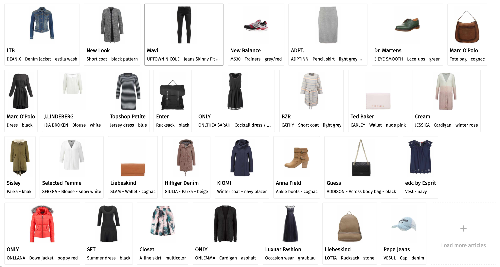
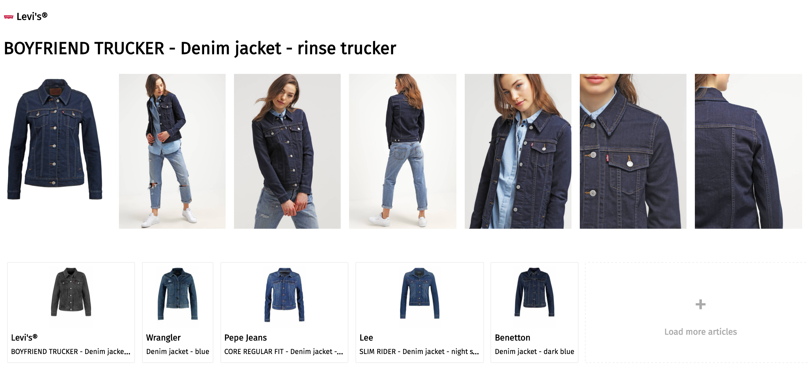

# Zalando in GraphQL/Relay

A small Relay app working with a GraphQL wrapper around the Zalando REST API.

## Running

Clone the repository, then do `npm install && npm start`.

## Developing

Install `nodemon` (`npm i -g nodemon`) and create two terminal sessions. Run `nodemon server` in one and `npm run client` in the other.
